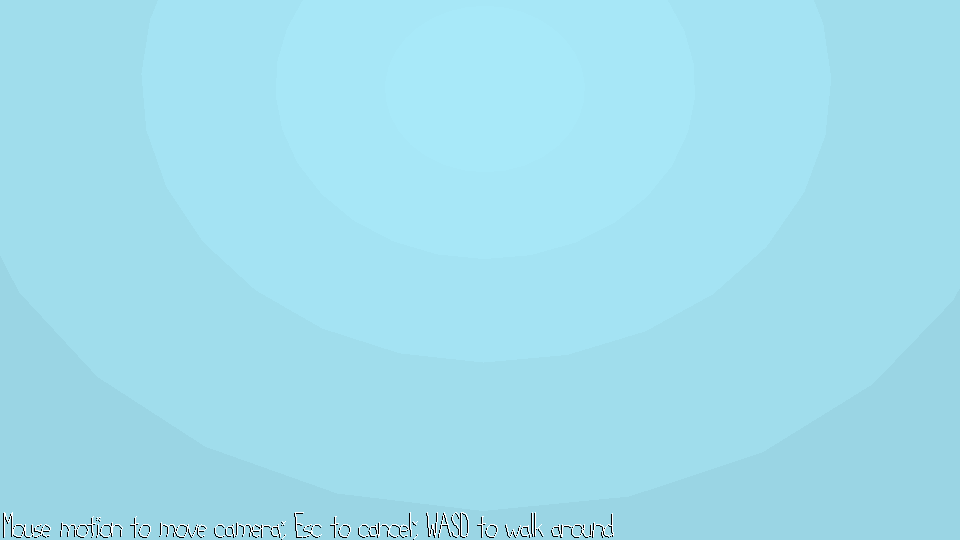

# snow globe walk

Author: Yoseph Mak

Design: This is a walking simulator where you walk inside a snowglobe, so you walk inside the mesh instead of outside it.

Screen Shot:

How To Play:

Use the WASD keys to walk around inside the snow globe. If you need to rotate the camera, use the mouse, and press escape to cancel mouse rotation.

Sources:
All assets were made by me.

This game was built with [NEST](NEST.md).

